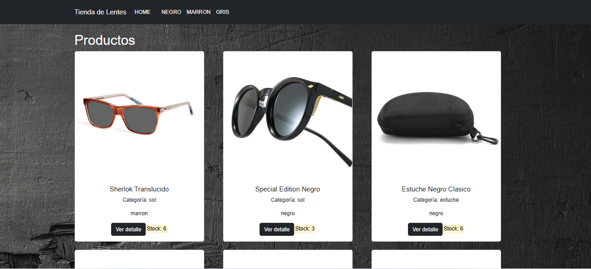

# 👓 Tienda de Lentes

E-commerce store built with **React**, using Context API and a custom hook for cart management, React Router for navigation, and **Firebase Firestore** as a real cloud database.

🔗 **Live demo:** [https://gabriellyferreiraa.github.io/Tienda-de-Lentes/]


<!-- Replace with a real screenshot of the store's main screen -->

---

## 🇬🇧 English

### About the project
An e-commerce store for sunglasses/eyewear, built as a React learning project. Products are stored in a real Firebase Firestore database and loaded dynamically, filtered by category and color. Users can add items to a cart, adjust quantities, and submit an order, which is saved to Firestore as well.

### Features
- Dynamic product catalog loaded from Firebase Firestore
- Filtering by category and by color (via route params)
- Shopping cart with global state managed through React Context + a custom hook (`useCart`)
- Client-side routing with React Router (product list, product detail, cart)
- Order submission saved directly to Firestore
- UI built with React-Bootstrap

### Tech stack
- React 18
- React Router
- Firebase (Firestore)
- React-Bootstrap
- Create React App

### Running locally
```bash
git clone https://github.com/GabriellyFerreiraa/Tienda-de-Lentes.git
cd Tienda-de-Lentes
npm install
npm start
```
The app runs at `http://localhost:3000`. Note: this project connects to a live Firebase project to load products, so a working internet connection and valid Firestore data are required to see the catalog populated.

---

## 🇪🇸 Español

### Sobre el proyecto
Una tienda online de lentes/anteojos, creada como proyecto de aprendizaje en React. Los productos se almacenan en una base de datos real de Firebase Firestore y se cargan dinámicamente, con filtros por categoría y color. El usuario puede agregar productos al carrito, ajustar cantidades y enviar un pedido, que también se guarda en Firestore.

### Funcionalidades
- Catálogo de productos dinámico, cargado desde Firebase Firestore
- Filtro por categoría y por color (mediante parámetros de ruta)
- Carrito de compras con estado global manejado con React Context + un hook personalizado (`useCart`)
- Navegación con React Router (listado de productos, detalle de producto, carrito)
- Envío de pedidos guardado directamente en Firestore
- Interfaz construida con React-Bootstrap

### Tecnologías utilizadas
- React 18
- React Router
- Firebase (Firestore)
- React-Bootstrap
- Create React App

### Cómo ejecutar localmente
```bash
git clone https://github.com/GabriellyFerreiraa/Tienda-de-Lentes.git
cd Tienda-de-Lentes
npm install
npm start
```
La app corre en `http://localhost:3000`. Nota: este proyecto se conecta a un proyecto real de Firebase para cargar los productos, por lo que se necesita conexión a internet y datos válidos en Firestore para ver el catálogo con contenido.

---

## 🇧🇷 Português

### Sobre o projeto
Uma loja online de óculos/lentes, criada como projeto de aprendizado em React. Os produtos ficam armazenados num banco de dados real do Firebase Firestore e são carregados dinamicamente, com filtro por categoria e por cor. O usuário pode adicionar produtos ao carrinho, ajustar quantidades e enviar um pedido, que também é salvo no Firestore.

### Funcionalidades
- Catálogo de produtos dinâmico, carregado do Firebase Firestore
- Filtro por categoria e por cor (via parâmetros de rota)
- Carrinho de compras com estado global gerenciado com React Context + um hook customizado (`useCart`)
- Navegação com React Router (lista de produtos, detalhe do produto, carrinho)
- Envio de pedidos salvo diretamente no Firestore
- Interface construída com React-Bootstrap

### Tecnologias utilizadas
- React 18
- React Router
- Firebase (Firestore)
- React-Bootstrap
- Create React App

### Como rodar localmente
```bash
git clone https://github.com/GabriellyFerreiraa/Tienda-de-Lentes.git
cd Tienda-de-Lentes
npm install
npm start
```
O app roda em `http://localhost:3000`. Atenção: esse projeto se conecta a um projeto real do Firebase pra carregar os produtos, então é preciso ter conexão com a internet e dados válidos no Firestore pra ver o catálogo com conteúdo.

---

## 👩‍💻 Author / Autora

**Gabrielly Ferreira**
📫 gabiferreira101@gmail.com
🔗 [LinkedIn](https://www.linkedin.com/in/gabrielly-ferreira-619609113/)
